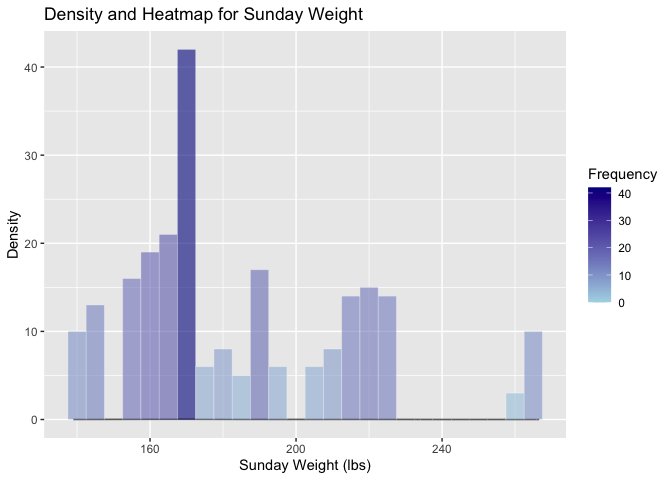

Portfolio_02
================
Enhui Wang
2025-02-01

I worked on this project “Choose some data from EDA (Exploratory Data
Analysis) or VDat (Visualizing Data); table or plot them in a way that
Tukey/Cleveland didn’t.” I created a combined density plot and heatmap
visualization for the “sunday_weight” variable (i.e., represent weight
data) for visualizing the shape of the distribution and the frequency of
observations.

``` r
#open data
library(readr)
Data_01 <- read_csv("Data_01.csv")
```

    ## Rows: 324 Columns: 6
    ## ── Column specification ────────────────────────────────────────────────────────
    ## Delimiter: ","
    ## chr (4): participant_id, redcap_event_name, redcap_repeat_instrument, sunday...
    ## dbl (2): redcap_repeat_instance, weekly_journal
    ## 
    ## ℹ Use `spec()` to retrieve the full column specification for this data.
    ## ℹ Specify the column types or set `show_col_types = FALSE` to quiet this message.

``` r
View(Data_01)
library(ggplot2)
```

``` r
#Filter out non NA in the sunday_weight variable 
filtered_data <- na.omit(Data_01$sunday_weight)

#create a data frame for plotting
plot_data <- data.frame(weight=filtered_data)

#ensure weight is numeric
plot_data$weight <- as.numeric(plot_data$weight)
```

    ## Warning: NAs introduced by coercion

``` r
#create a density plot and heatmap for sunday_weight
plot <- ggplot(plot_data, aes(x = weight)) +
# the density curve is to visualize the overall shape of the distribution of the data
  geom_density(fill = "blue", alpha = 0.7) +
# the heatmap-like bins show how many data points fall within particular intervals; the visualization helps to see high or low-frequency regions.
  stat_bin(binwidth = 5, aes(y = ..count.., fill = ..count..),#add a binning layer and set each bin to cover 5 units in weight.
           geom = "tile", color = "white", alpha = 0.6) + #make the bins rectangular. 
  labs(
    title = "Density and Heatmap for Sunday Weight",
    x = "Sunday Weight (lbs)",
    y = "Density"
  ) +
  scale_fill_gradient(low = "lightblue", high = "darkblue", name = "Frequency")
print (plot)
```

    ## Warning: The dot-dot notation (`..count..`) was deprecated in ggplot2 3.4.0.
    ## ℹ Please use `after_stat(count)` instead.
    ## This warning is displayed once every 8 hours.
    ## Call `lifecycle::last_lifecycle_warnings()` to see where this warning was
    ## generated.

    ## Warning: Removed 1 row containing non-finite outside the scale range
    ## (`stat_density()`).

    ## Warning: Removed 1 row containing non-finite outside the scale range
    ## (`stat_bin()`).

    ## Warning: Stacking not well defined when not anchored on the axis

<!-- --> According
to the plot, the peak is around 160 lbs. The darker blue bars suggest
the highest frequencies occur around the peak of the density curve
(e.g., 160 lbs), with progressively lower frequencies near the tails of
the distribution.
